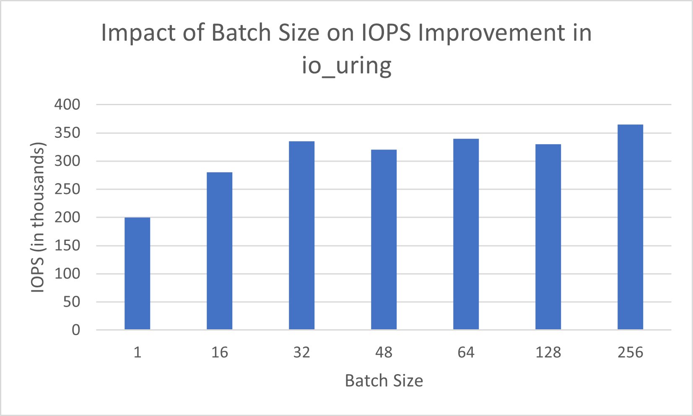
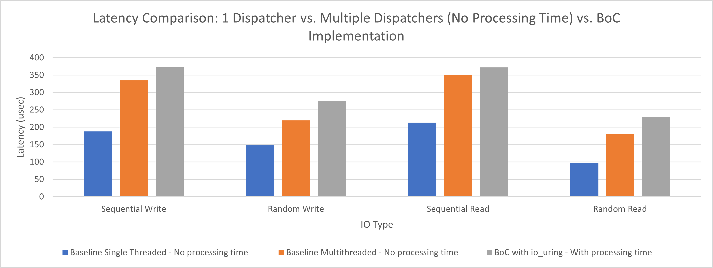
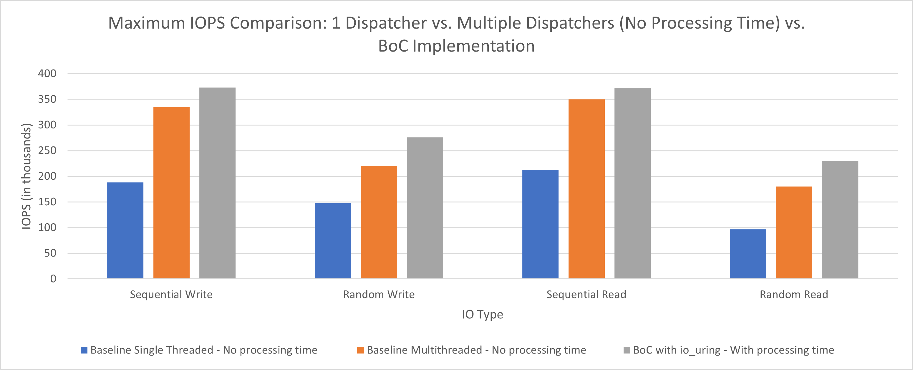
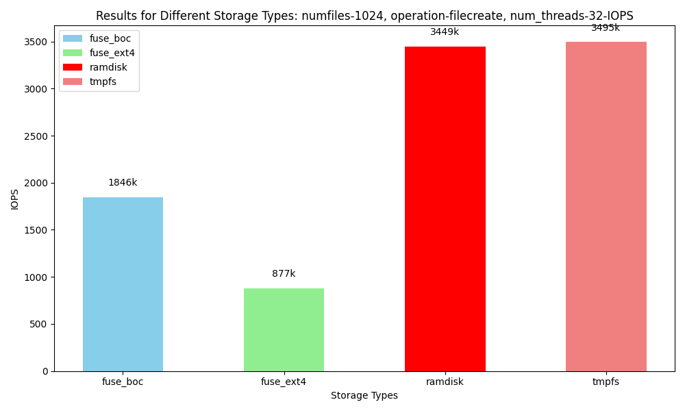

## Overview

The "MAX_THROUGHPUT_ANALYSIS_RESULTS" directory contains graphs that delve into the highest achievable Input/Output Operations Per Second (IOPS) via the /dev/fuse interface. This analysis eliminates the processing time of read and write operations and spans three scenarios: one dispatcher, multiple dispatchers, and one dispatcher with io_uring.

Within the "IMPACT_OF_BATCH_SIZE_RESULTS" folder, you'll find graphs illustrating the influence of io_uring batch sizes and the number of verona-rt workers on throughput and latency.

The "PLOT_DATA_WORKLOAD_IOPS_LATENCY_SCRIPTS" directory hosts scripts essential for reproducing the graphs from data-intensive workload experiments.

Finally, the "PLOT_METADATA_IOPS_LATENCY_SCRIPTS" directory contains scripts necessary for replicating the graphs obtained from data-intensive workload experiments.

## Evaluation Results

### Plots Directory

This directory contains various plot files that illustrate the results of the evaluation. Each plot corresponds to a specific aspect of the evaluation. The following files are available:

- **Impact of Batch Size on IOPS Improvement in IO_uring**
  - 

- **Latency Comparison: 1 Dispatcher vs. Multiple Dispatchers vs. BoC Implementation**
  - 

- **Maximum IOPS Comparison: 1 Dispatcher vs. Multiple Dispatchers vs. BoC Implementation**
  - 

### How to Navigate

The `plot_iops/charts/Performance_Data` directory contains performance data plots with various configurations. Each subdirectory within `plot_iops` represents a specific set of experiments. See the following exampleexamples:

- **Experiment 1: 10G - 128 Files - 16 Threads - 4k Block Size**
  - IOPS Comparison: 
  - Latency Comparison: 

In the `plot_metadata` directory you can find the results for the metadata operations([File Creation](https://fio.readthedocs.io/en/latest/fio_doc.html#i-o-engine), [File Deletion](https://fio.readthedocs.io/en/latest/fio_doc.html#i-o-engine), [Stat on Files](https://fio.readthedocs.io/en/latest/fio_doc.html#i-o-engine))

- **IOPS Comparison: 1G/1024/32**
  - This plot compares the Input/Output Operations Per Second (IOPS) achieved during the file creation of 1024 files. The configurations are the following:
    - File Size: 1G (1 Gigabyte)
    - Number of Files: 1024
    - Number of Jobs: 32
    - Block Size: 1024 (bytes)
    - Operation: File Create
  
  

## How to Reproduce the Evaluation

There are instructions on each folder explaining on how to reproduce the evaluation. The whole procedure of bar charts generation is automated using python scripts. 

