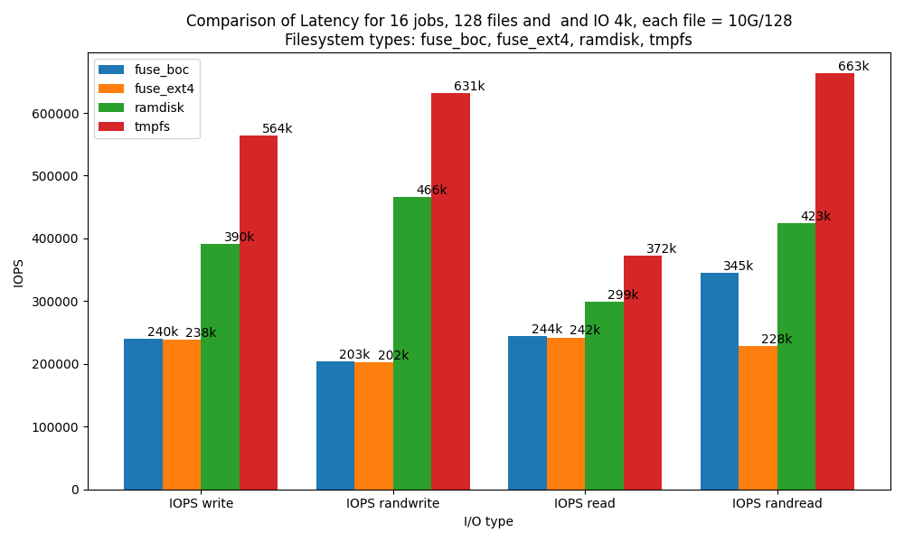
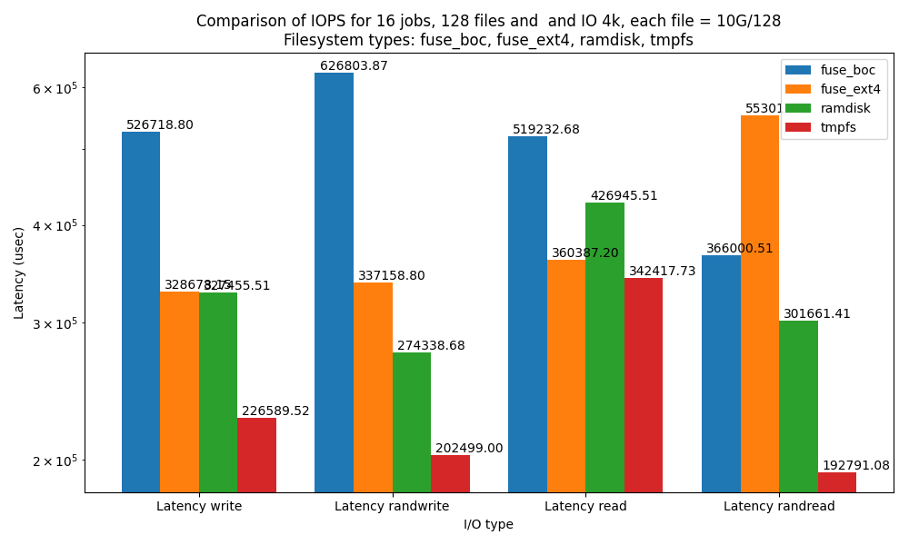

# Project Title

Short description of your project.

## Overview

Provide an overview of the project and its purpose. Mention the context of the evaluation and the goals you aimed to achieve.

## Evaluation Results

### Plots Directory

This directory contains various plot files that illustrate the results of the evaluation. Each plot corresponds to a specific aspect of the evaluation. The following files are available:

- **Impact of Batch Size on IOPS Improvement in IO_uring**
  - 

- **Latency Comparison: 1 Dispatcher vs. Multiple Dispatchers vs. BoC Implementation**
  - 

- **Maximum IOPS Comparison: 1 Dispatcher vs. Multiple Dispatchers vs. BoC Implementation**
  - 

### How to Navigate

The `plot_iops/charts/Performance_Data` directory contains performance data plots with various configurations. Each subdirectory within `plot_iops` represents a specific set of experiments. See the following exampleexamples:

- **Experiment 1: 10G - 128 Files - 16 Threads - 4k Block Size**
  - IOPS Comparison: 
  - Latency Comparison: 

## How to Reproduce the Evaluation

There are instructions on each folder explaining on how to reproduce the evaluation. The whole procedure of bar charts generation is automated using python scripts. 

